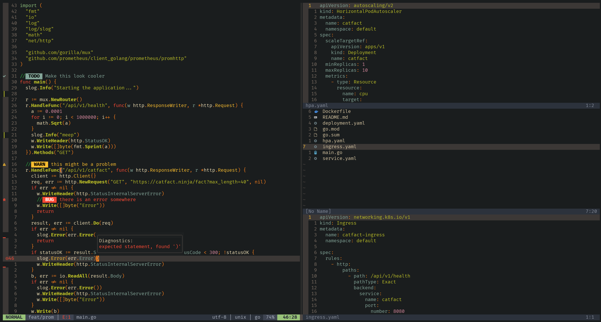
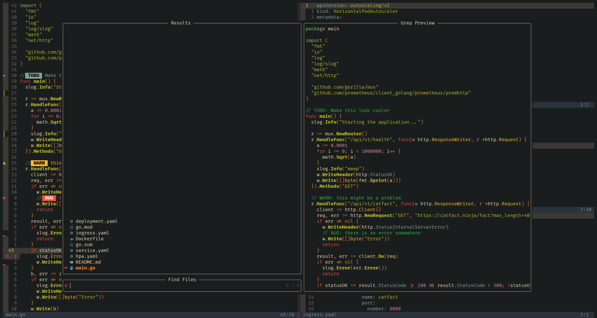

# Minimalistic NVIM config

## WHY?
1. For the glory of satan, of course.
2. Personal PDE configuration.
3. More minimalistic, distraction free.
4. No neck pain, zen mode.
5. Fully telescope + harpoon + no tabs buffer oriented.

## Dependencies

- git
- ripgrep

## Installation

